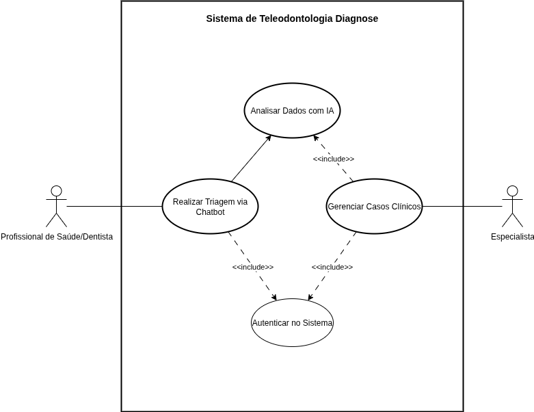

## (i) O objetivo que será abordado no trabalho

O objetivo geral do trabalho é desenvolver e implementar um sistema de teleodontologia para automatizar a triagem inicial de casos clínicos, visando otimizar o atendimento odontológico. A plataforma busca agilizar a identificação de casos urgentes e o encaminhamento correto dos pacientes.

## (ii) O problema que será resolvido pela solução de software planejada

A solução planejada visa resolver a ineficiência e a desorganização na comunicação entre profissionais de saúde, dentistas e especialistas, que atualmente dependem de métodos não estruturados como mensagens de texto, e-mails e chamadas telefônicas. A falta de um sistema padronizado para a coleta de dados e triagem de urgência pode ocasionar atrasos na avaliação de casos graves, comprometendo o diagnóstico e o tratamento. Além disso, o projeto aborda as dificuldades de acesso a uma primeira avaliação por parte de pacientes em áreas remotas ou com mobilidade reduzida.

## (iii) O tipo de solução que será desenvolvido

Será desenvolvido um sistema de teleodontologia que consiste em um chatbot (autômato conversacional) via WhatsApp, um backend para processamento e armazenamento de dados, e uma interface web para especialistas. A solução empregará inteligência artificial multimodal, com módulos de análise textual (LLM) e visual (Visão Computacional), para oferecer um pré-diagnóstico e um sistema de ordenação inteligente dos casos por prioridade. A arquitetura será baseada em microsserviços para garantir escalabilidade e manutenibilidade.

## (iv) Os requisitos funcionais e não funcionais da aplicação

### Requisitos Funcionais

- **Coleta de Dados via Chatbot:** O chatbot deve ser capaz de guiar o usuário na coleta de informações através de um questionário e receber fotos da região orofacial.
- **Armazenamento de Dados:** O sistema deve receber os dados do chatbot e armazená-los de forma persistente em um banco de dados.
- **Classificação de Urgência:** Um algoritmo deve classificar os casos em categorias de urgência (ex: "Urgente", "Moderado", "Rotina") com base nas informações coletadas.
- **Geração de Pré-diagnóstico:** Módulos de IA devem analisar textos e imagens para sugerir possíveis condições e identificar anomalias.
- **Priorização de Casos:** O sistema deve consolidar as análises para gerar um score de prioridade e ordenar os casos para o especialista.
- **Interface para Especialistas:** Deve haver uma interface web segura para que especialistas possam visualizar, gerenciar e revisar os casos triados e priorizados.
- **Autenticação de Usuários:** O sistema deve possuir uma tela de login para autenticação dos profissionais.

### Requisitos Não Funcionais

- **Segurança e Privacidade:** O sistema deve garantir a privacidade dos usuários através de criptografia de ponta a ponta, políticas de retenção de dados, protocolos de anonimização e logs de auditoria.
- **Escalabilidade:** A arquitetura de microsserviços e o uso de armazenamento de mídia em nuvem (AWS S3 ou similar) visam garantir a escalabilidade da solução.
- **Usabilidade:** A interação com o chatbot deve ser guiada e a interface para o especialista deve permitir a fácil visualização e gerenciamento dos casos.
- **Conformidade:** A solução deve estar em conformidade com a Lei Geral de Proteção de Dados (LGPD).
- **Manutenibilidade:** A arquitetura de microsserviços é adotada para facilitar a manutenção do sistema.

## (v) O diagrama de caso de uso da aplicação

