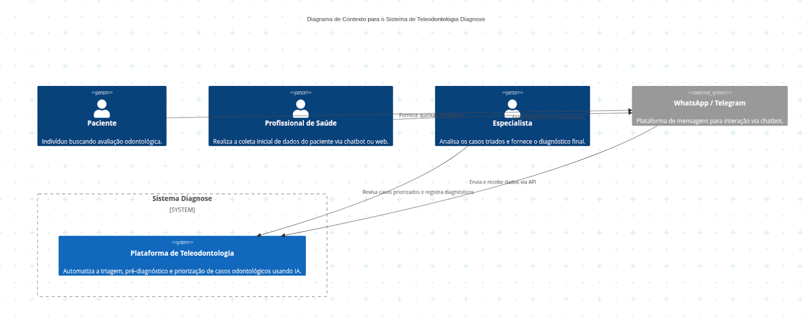
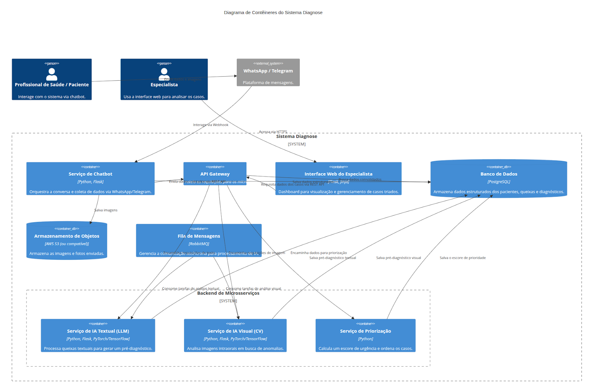
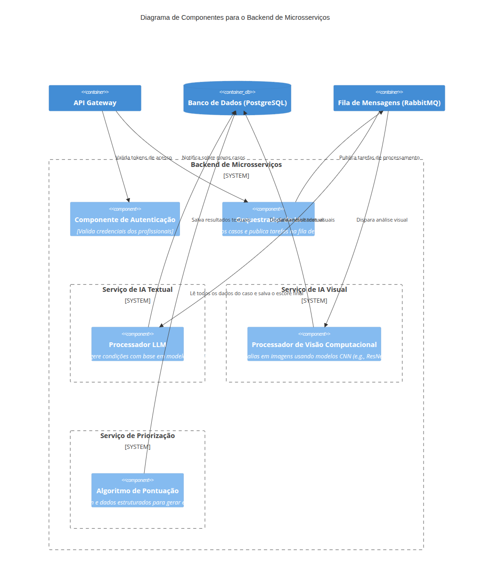

# Documentação de Arquitetura: Sistema Diagnose
Este documento detalha a arquitetura de software do Sistema de Teleodontologia com Diagnóstico Inteligente (Diagnose). O objetivo do sistema é automatizar a triagem inicial de casos clínicos odontológicos através de uma plataforma que utiliza um chatbot para coleta de dados e inteligência artificial para pré-diagnóstico e priorização, otimizando o fluxo de trabalho de especialistas.

A documentação a seguir está estruturada segundo o Modelo C4, fornecendo uma visualização clara e hierárquica do sistema, do contexto geral aos componentes específicos.

## Justificativa do Modelo Arquitetural
### Escolha do Modelo C4
O C4 Model foi escolhido por sua capacidade de descrever uma arquitetura de software em diferentes níveis de abstração (Contexto, Contêineres, Componentes e Código). Essa abordagem facilita a comunicação entre todas as partes interessadas, desde equipes de desenvolvimento até gestores de produto, permitindo que cada um compreenda o sistema no nível de detalhe que lhe é relevante.
### Escolha da Arquitetura de Microsserviços
A arquitetura do sistema foi projetada com base no padrão de microsserviços para garantir alta escalabilidade, resiliência e manutenibilidade. Essa escolha se justifica pelos seguintes motivos:

- **Modularidade e Manutenção:** Cada funcionalidade principal, como a análise textual (LLM), a análise visual (CV) e o sistema de priorização, é encapsulada em um serviço independente. Isso permite que as equipes desenvolvam, implantem e atualizem cada serviço de forma autônoma, sem impactar o restante do sistema.
- **Escalabilidade:** É possível escalar serviços individualmente conforme a demanda. Por exemplo, se a análise de imagens se tornar um gargalo, apenas os recursos para o serviço de visão computacional precisam ser aumentados.
- **Resiliência:** A falha em um serviço não compromete o funcionamento de todo o sistema. Por exemplo, se o serviço de pré-diagnóstico textual estiver temporariamente indisponível, o sistema ainda pode processar as imagens e os dados do formulário.
- **Flexibilidade Tecnológica:** Cada microsserviço pode ser desenvolvido com a tecnologia mais adequada para sua função específica.
## Projeto Arquitetural (Modelo C4)
### Nível 1: Diagrama de Contexto do Sistema
Os diagramas foram especificados na linguagem Mermaid e gerados no editor MermaidChart. Como limitação da ferramenta utilizada, observamos a impossibilidade de mover os objetos gerados.

    

O Sistema Diagnose interage com três tipos de usuários: o Paciente, que fornece suas informações; o Profissional de Saúde, que realiza a triagem inicial; e o Especialista, que analisa os casos já processados pela plataforma. A principal interface de entrada de dados é um chatbot que opera em sistemas externos como WhatsApp ou Telegram. O especialista interage com o sistema por meio de uma interface web dedicada.
### Nível 2: Diagrama de Contêineres
Este diagrama detalha a estrutura interna do Sistema Diagnose, mostrando os principais contêineres (aplicações, bancos de dados e sistemas de armazenamento) que compõem a solução.

    

Descrição do fluxo: o Profissional de Saúde ou o Paciente interage com o Serviço de Chatbot via WhatsApp. O chatbot coleta as informações e as envia para o Banco de Dados (PostgreSQL) e para o Armazenamento de Objetos (S3). Após a coleta, uma mensagem é publicada na Fila de Mensagens (RabbitMQ) para iniciar o processamento assíncrono. Os microsserviços de IA Textual (LLM) e IA Visual (CV) consomem as tarefas da fila, processam os dados e salvam os resultados (pré-diagnósticos) no banco de dados. O Serviço de Priorização consolida todas as informações e gera um escore de urgência, ordenando os casos para o especialista. O Especialista acessa a Interface Web, que consome os dados já processados via API Gateway, para revisar e emitir o parecer final.
### Nível 3: Diagrama de Componentes
Este diagrama foca nos componentes internos de um contêiner específico. Escolhemos detalhar o Backend de Microsserviços, pois ele concentra a lógica de negócio e de inteligência artificial do sistema.

    

- **Componente de Autenticação:** Responsável por validar as credenciais dos profissionais de saúde que acessam o sistema.
- **Orquestrador de IA:** Ponto central que recebe a notificação de um novo caso e dispara os fluxos de processamento de forma assíncrona, publicando tarefas na fila.
- **Processador LLM:** Utiliza um Large Language Model (LLM) para analisar as queixas do paciente, gerar um resumo e sugerir possíveis diagnósticos com base na literatura.
- **Processador de Visão Computacional:** Aplica um modelo de Rede Neural Convolucional (CNN) para analisar as imagens em busca de anomalias visuais, como cáries e inflamações.
- **Algoritmo de Pontuação:** Consolida os dados do questionário e as saídas dos modelos de IA para calcular uma pontuação final que define a prioridade do caso na fila do especialista.

### Escolhas Tecnológicas

A tabela a seguir resume as principais escolhas tecnológicas e suas justificativas.

| Tecnologia | Categoria | Justificativa |
|---|---|---|
| Python 3.11+ | Linguagem (Backend) | Linguagem robusta com um ecossistema maduro para desenvolvimento web e, principalmente, para aplicações de Inteligência Artificial e Machine Learning. |
| Flask | Framework Web (Backend) | Framework minimalista e flexível, ideal para a construção de APIs RESTful e microsserviços, conforme a arquitetura proposta. |
| PostgreSQL | Banco de Dados | Sistema de gerenciamento de banco de dados relacional de código aberto, conhecido por sua robustez, confiabilidade e conformidade com padrões SQL. |
| AWS S3 (ou compatível) | Armazenamento de Mídia | Solução de armazenamento de objetos altamente escalável, segura e de baixo custo, ideal para guardar as imagens e documentos dos pacientes. |
| Docker / Kubernetes | Conteinerização e Orquestração | Utilizado para empacotar a aplicação e suas dependências, garantindo consistência entre ambientes de desenvolvimento e produção. Kubernetes é a escolha para a orquestração em produção, permitindo escalabilidade e alta disponibilidade. |
| PyTorch / TensorFlow | Frameworks de IA | Plataformas líderes para o desenvolvimento e treinamento de modelos de deep learning, tanto para o serviço de visão computacional (CV) quanto para o de processamento de linguagem natural (LLM). |
| LLMs (GPT, Gemini) | Modelos de IA (Texto) | Modelos de linguagem de ponta que podem ser utilizados via API ou auto-hospedados para realizar tarefas complexas de sumarização e pré-diagnóstico textual com alta acurácia. |
| RabbitMQ | Fila de Mensagens | Implementa a comunicação assíncrona entre os microsserviços, desacoplando os componentes e garantindo que o processamento de IA não bloqueie o fluxo principal da aplicação. |
| Gupshup (ou similar) | Provedor de Solução de Negócios (BSP) | Plataforma que gerencia a API do WhatsApp Business, necessária para a comunicação do chatbot com os usuários finais. A escolha se baseia na estrutura de custos por mensagem. |

